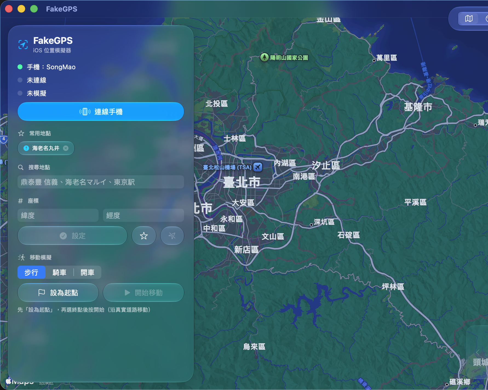

# FakeGPS

**English** · [繁體中文](README.zh-TW.md)

> Simulate your iPhone's GPS location from your Mac — search any place, tap the map, done.

A native macOS app (SwiftUI + MapKit) that sets a custom GPS location on an iPhone over USB,
powered by [pymobiledevice3](https://github.com/doronz88/pymobiledevice3). Features Apple Maps
search, a tap-to-set map, saved bookmarks, a Liquid Glass interface, and a one-time setup so you
never have to type your password on every launch.


-success)




---

## Quick Start

**Option A — Download & run** (no Xcode needed)

Grab the latest `FakeGPS-*.zip` from [Releases](https://github.com/silas4336/FakeGPS/releases),
unzip it, then in Terminal:

```bash
cd ~/Downloads/FakeGPS
./install.sh
```

**Option B — From source**

```bash
git clone https://github.com/silas4336/FakeGPS.git
cd FakeGPS
./install.sh          # or: make install
```

Either way, `install.sh` handles everything: it installs the dependencies, sets up the
permissions, and copies the app to `/Applications`. Plug in your iPhone, open FakeGPS, and go.

## Features

- **Native SwiftUI app** with a Liquid Glass UI (macOS 26+; falls back to a frosted material on older systems)
- **Apple Maps search** (`MKLocalSearch`) — no API key, great results for places in any language; results also appear as map pins
- **Tap the map** to set a location (with reverse-geocoded name), drag the pin, or type coordinates directly
- **Route / movement simulation** — move along a real road route (via `MKDirections`) at walking / cycling / driving speed, for testing navigation and fitness apps
- **Map styles** — switch between standard, hybrid, and satellite
- **Bookmarks & recents** — one-tap switching to favorites; recently-used locations are remembered automatically
- **Nudge controls + keyboard shortcuts** — arrow keys to fine-tune position (great for games/AR), ⌘⏎ to set, ⌘K to clear
- **No repeated password prompts** — a NOPASSWD helper is configured once at install
- Works on **iOS 17+** (modern RemoteXPC tunnel) and both **Apple Silicon and Intel** (Universal binary)

## Requirements

| Requirement | Notes |
|-------------|-------|
| macOS 14+ | Apple Silicon or Intel |
| Xcode Command Line Tools | `xcode-select --install` — full Xcode is **not** required (only when building from source) |
| Homebrew | The installer offers to install it if missing |
| iPhone Developer Mode | Settings → Privacy & Security → Developer Mode |

`libimobiledevice` and `pymobiledevice3` are installed automatically.

## Usage

1. Connect your iPhone via USB, unlock it, and tap **Trust** if prompted.
2. Open **FakeGPS**. (If Gatekeeper blocks it the first time: right-click the app → Open → Open.)
3. Click **Connect** to establish the tunnel (no password needed).
4. Search for a place, tap the map, or use a bookmark, then click **Set**.
5. Open Maps on your phone to confirm the location moved.

The simulated location is **temporary** — it reverts to real GPS when you clear it, quit the app,
unplug the phone, or reboot. Nothing on the phone is permanently modified.

## Make targets

```
make install     # full install (deps + build + permissions + /Applications)
make build       # build the Universal app into ./build
make run         # build and launch
make doctor      # diagnose your environment
make uninstall   # remove everything
```

Run **`make doctor`** first if anything misbehaves — it checks each prerequisite and tells you
exactly what's missing and how to fix it.

## How it works

```
┌─────────────────┐   Process    ┌──────────────────────┐  USB tunnel  ┌────────┐
│  FakeGPS.app    │ ───────────▶ │  pymobiledevice3     │ ───────────▶ │ iPhone │
│  (SwiftUI UI)   │              │  (Python)            │              └────────┘
└─────────────────┘              └──────────────────────┘
        │ sudo -n (NOPASSWD)
        ▼
  /usr/local/libexec/fakegps_tunnel.sh   ← root-owned helper that opens the RemoteXPC tunnel
```

The Swift app is a thin native shell that drives `pymobiledevice3` via `Process` to mount the
Developer Disk Image and set/clear the location. The tunnel requires root, so a small root-owned
helper is whitelisted in `/etc/sudoers.d/fakegps` for the installing user only — that's why no
password is needed at runtime.

## Troubleshooting

| Symptom | Fix |
|---------|-----|
| "App can't be opened / unidentified developer" | Right-click the app → Open → Open (it's ad-hoc signed, not notarized) |
| Status stuck on "no device detected" | Use a data-capable cable, unlock the phone, tap **Trust**; run `make doctor` |
| Connect times out | Enable **Developer Mode** on the iPhone; reconnect USB and retry |
| Connect asks for a password | The NOPASSWD helper isn't set up — re-run `./install.sh` |
| Location set but the map doesn't move | Tap the locate button in Maps; confirm the status row shows "simulating" |

## Disclaimer

For **legitimate use** only — app development, testing location features, and privacy. Using it to
deceive services, violate terms of service, or commit fraud is your responsibility. Use it legally
and ethically.

## License

MIT — see [LICENSE](LICENSE).
